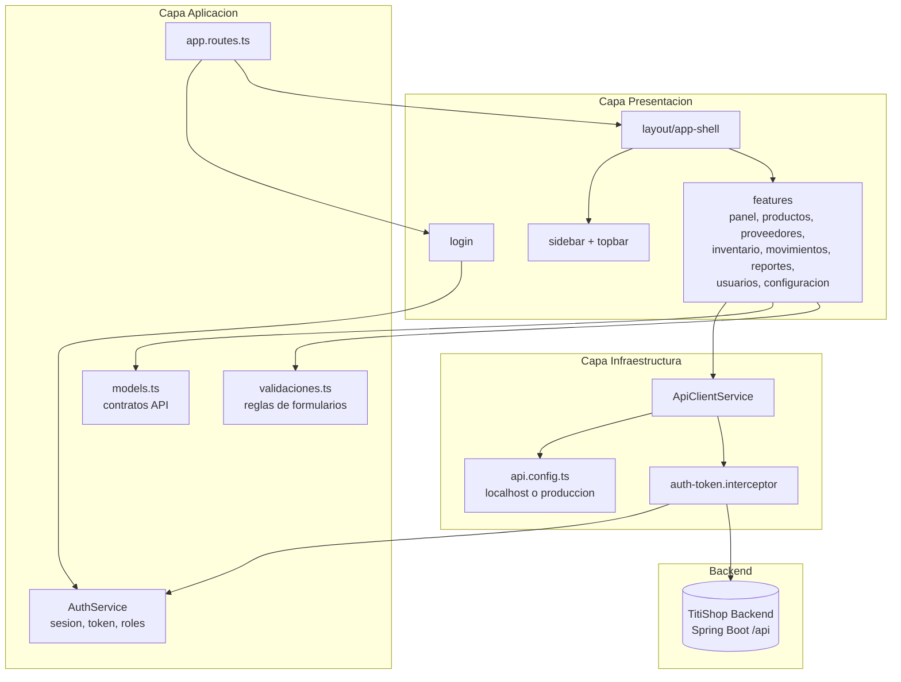

# TitiShop Frontend

## 1. Descripcion del proyecto

Aplicacion frontend construida con Angular para operar el sistema TitiShop desde una interfaz web.

Este repositorio contiene:

- pantalla de autenticacion,
- layout principal con sidebar y topbar,
- rutas protegidas por sesion y roles,
- modulos de productos, proveedores, inventario, movimientos, reportes, usuarios y configuracion,
- servicios HTTP alineados con la API Spring Boot,
- modelos TypeScript para contratos frontend-backend,
- manejo de token JWT en `sessionStorage`,
- estilos globales con Tailwind CSS y Bootstrap Icons.

## 2. Objetivo del frontend

Proveer la interfaz web del sistema TitiShop para que los usuarios autenticados puedan administrar catalogos, controlar inventario, registrar movimientos, consultar reportes y revisar indicadores operativos.

El frontend consume el backend en:

```text
Local:      http://localhost:8080/api
Produccion: https://api-titishop.proyectoutp.com/api
```

## 3. Estado de implementacion

El frontend tiene implementadas las vistas principales del flujo operativo:

- login,
- panel/dashboard,
- productos,
- proveedores,
- inventario,
- movimientos,
- reportes,
- usuarios,
- configuracion.

Tambien incluye pruebas unitarias para rutas, configuracion de API, validaciones y componentes base.

## 4. Arquitectura y stack

| Stack                         | Uso en el proyecto                                  |
| ----------------------------- | --------------------------------------------------- |
| Angular 21                    | Framework principal SPA.                            |
| TypeScript 5.9                | Lenguaje base del frontend.                         |
| Angular Router                | Definicion de rutas, guards inline y redirecciones. |
| Reactive Forms                | Manejo de formularios tipados en componentes.       |
| Angular HttpClient            | Consumo de endpoints REST del backend.              |
| Angular Signals               | Estado reactivo de sesion en `AuthService`.         |
| RxJS                          | Flujos HTTP y side effects de autenticacion.        |
| Tailwind CSS 4                | Utilidades de estilos globales.                     |
| Bootstrap Icons               | Iconografia de la interfaz.                         |
| Vitest / Angular Test Builder | Pruebas unitarias.                                  |
| jsdom                         | Entorno de pruebas tipo navegador.                  |
| PNPM 11.5.0                   | Gestor de paquetes.                                 |
| Nginx                         | Servidor estatico para Docker/produccion.           |

## 5. Dependencias principales

Dependencias declaradas en `package.json`.

**Dependencias de produccion:**

- `@angular/common`, `@angular/compiler`, `@angular/core`, `@angular/forms`, `@angular/platform-browser`, `@angular/router` v21.2.x
- `bootstrap-icons` v1.13.1
- `rxjs` v7.8.x
- `tslib` v2.3.x
- `zone.js` v0.16.x

**Dependencias de desarrollo:**

- `@angular/build` v21.2.8
- `@angular/cli` v21.2.8
- `@angular/compiler-cli` v21.2.x
- `@tailwindcss/postcss` v4.3.0
- `@tailwindcss/vite` v4.3.0
- `tailwindcss` v4.3.0
- `postcss` v8.5.x
- `typescript` v5.9.x
- `vitest` v4.0.x
- `jsdom` v28.0.x
- `prettier` v3.8.x

## 6. Estructura del proyecto

```text
titishop-frontend-angular/
├── src/
│   ├── app/
│   │   ├── core/
│   │   │   ├── http/
│   │   │   │   ├── api-client.service.ts
│   │   │   │   └── auth-token.interceptor.ts
│   │   │   ├── api-error.ts
│   │   │   ├── api.config.ts
│   │   │   ├── auth.service.ts
│   │   │   ├── estado-carga.ts
│   │   │   ├── models.ts
│   │   │   └── validaciones.ts
│   │   ├── features/
│   │   │   ├── configuracion/
│   │   │   ├── inventario/
│   │   │   ├── layout/
│   │   │   │   ├── app-shell/
│   │   │   │   ├── sidebar/
│   │   │   │   └── topbar/
│   │   │   ├── login/
│   │   │   ├── movimientos/
│   │   │   ├── panel/
│   │   │   ├── productos/
│   │   │   ├── proveedores/
│   │   │   ├── reportes/
│   │   │   └── usuarios/
│   │   ├── app.config.ts
│   │   ├── app.routes.ts
│   │   └── app.ts
│   ├── index.html
│   ├── main.ts
│   ├── styles.scss
│   └── tailwind.css
├── Dockerfile
├── nginx.conf
├── angular.json
├── package.json
├── pnpm-lock.yaml
└── README.md
```

## 7. Modulos y rutas implementadas

Rutas definidas en `src/app/app.routes.ts`.

### Rutas publicas

| Ruta     | Componente | Descripcion                  |
| -------- | ---------- | ---------------------------- |
| `/login` | `Login`    | Formulario de autenticacion. |

### Rutas protegidas

Todas las rutas internas usan `AppShell` y requieren sesion activa mediante `requireAuth`.

| Ruta             | Componente      | Acceso                         |
| ---------------- | --------------- | ------------------------------ |
| `/inicio`        | `Panel`         | Usuario autenticado            |
| `/dashboard`     | `Panel`         | Usuario autenticado            |
| `/productos`     | `Productos`     | Usuario autenticado            |
| `/proveedores`   | `Proveedores`   | Usuario autenticado            |
| `/inventario`    | `Inventario`    | Usuario autenticado            |
| `/movimientos`   | `Movimientos`   | Usuario autenticado            |
| `/reportes`      | `Reportes`      | `ADMINISTRADOR` / `SUPERVISOR` |
| `/usuarios`      | `Usuarios`      | `ADMINISTRADOR`                |
| `/configuracion` | `Configuracion` | `ADMINISTRADOR`                |

### Comportamiento de enrutamiento

- `/login` se bloquea para usuarios ya autenticados y redirige a `/dashboard`.
- Las rutas internas validan que exista usuario de sesion y token.
- La ruta interna vacia redirige a `/dashboard`.
- La ruta wildcard redirige a `/dashboard`.
- Si un usuario autenticado no tiene el rol requerido, se redirige a `/dashboard`.

## 8. Capa core

| Archivo                                       | Responsabilidad                                                       |
| --------------------------------------------- | --------------------------------------------------------------------- |
| `src/app/core/api.config.ts`                  | Calcula la URL base del backend segun host local o produccion.        |
| `src/app/core/auth.service.ts`                | Login, logout, restauracion de sesion, token y verificacion de roles. |
| `src/app/core/models.ts`                      | Contratos TypeScript compartidos con la API.                          |
| `src/app/core/api-error.ts`                   | Estructura de errores HTTP de la API.                                 |
| `src/app/core/estado-carga.ts`                | Estados reutilizables para carga, exito, error y vacio.               |
| `src/app/core/validaciones.ts`                | Validaciones compartidas de formularios.                              |
| `src/app/core/http/api-client.service.ts`     | Cliente HTTP generico para GET, POST, PUT y DELETE.                   |
| `src/app/core/http/auth-token.interceptor.ts` | Interceptor que agrega `Authorization: Bearer {token}`.               |

## 9. Servicios por modulo

| Modulo        | Servicio                 | Backend consumido               |
| ------------- | ------------------------ | ------------------------------- |
| Autenticacion | `AuthService`            | `POST /api/autenticacion/login` |
| Productos     | `productos.service.ts`   | `/api/productos`                |
| Archivos      | `productos.service.ts`   | `POST /api/archivos/productos`  |
| Categorias    | `categorias.service.ts`  | `/api/categorias`               |
| Marcas        | `marcas.service.ts`      | `/api/marcas`                   |
| Proveedores   | `proveedores.service.ts` | `/api/proveedores`              |
| Inventario    | `inventario.service.ts`  | `/api/inventario`               |
| Movimientos   | `movimientos.service.ts` | `/api/movimientos`              |
| Reportes      | `reportes.service.ts`    | `/api/reportes`                 |
| Panel         | `panel.service.ts`       | `/api/panel/resumen`            |
| Usuarios      | `usuarios.service.ts`    | `/api/usuarios`                 |

## 10. Integracion con backend

La integracion se centraliza en `src/app/core/api.config.ts`.

```typescript
const API_LOCAL_URL = 'http://localhost:8080/api';
const API_PRODUCCION_URL = 'https://api-titishop.proyectoutp.com/api';
```

Reglas:

- Si el frontend corre en `localhost` o `127.0.0.1`, consume backend local en `http://localhost:8080/api`.
- En cualquier otro host, consume `https://api-titishop.proyectoutp.com/api`.
- `apiUrl()` normaliza rutas con o sin prefijo `/api`.
- Los servicios por modulo consumen endpoints REST del backend Spring Boot.

## 11. Seguridad y acceso

### Autenticacion

- El login envia email normalizado a minusculas y password a `/api/autenticacion/login`.
- El backend retorna token, tipo, expiracion y datos del usuario.
- El token se guarda en `sessionStorage` con la clave `token_sesion`.
- Los datos de usuario se guardan en `sessionStorage` con la clave `usuario_sesion`.
- Al recargar la pagina, `AuthService` intenta restaurar la sesion.
- El logout limpia la sesion y redirige al inicio.

### Autorizacion

Roles soportados:

- `ADMINISTRADOR`
- `ALMACENERO`
- `SUPERVISOR`

Proteccion en frontend:

- `requireAuth`: exige sesion y token.
- `onlyGuest`: evita que usuarios autenticados vuelvan a `/login`.
- `requireRoles`: valida roles permitidos por ruta.

Proteccion real de datos:

- El backend tambien valida roles en cada endpoint protegido.
- El frontend solo controla navegacion y experiencia de usuario; no reemplaza la autorizacion del backend.

## 12. Contratos principales

Los contratos viven en `src/app/core/models.ts`.

| Modelo                               | Uso                                                    |
| ------------------------------------ | ------------------------------------------------------ |
| `LoginRequest` / `LoginResponse`     | Autenticacion.                                         |
| `SessionUser`                        | Usuario actual en sesion.                              |
| `CategoriaResponse`, `MarcaResponse` | Catalogos de productos.                                |
| `ProductoResponse`                   | Productos con categoria, marca, precios e imagen.      |
| `ArchivoResponse`                    | Respuesta de carga de imagen.                          |
| `ProveedorResponse`                  | Proveedores y datos de contacto.                       |
| `ConsultaRucProveedorResponse`       | Datos obtenidos por consulta RUC.                      |
| `InventarioResponse`                 | Stock, stock minimo, ubicacion y estado.               |
| `MovimientoResponse`                 | Historial de entradas, salidas, ajustes y anulaciones. |
| `UsuarioResponse`                    | Usuarios, roles y estados.                             |
| `PanelResumenResponse`               | Indicadores del dashboard.                             |
| `Reporte*Response`                   | Reportes operativos y valorizacion.                    |

## 13. Ejecucion local

Requisitos:

- Node.js compatible con Angular 21
- PNPM 11.5.0
- Backend TitiShop ejecutandose en `http://localhost:8080`

Instalacion:

```bash
pnpm install
```

Servidor de desarrollo:

```bash
pnpm start
```

Aplicacion local:

```text
http://localhost:4200
```

## 14. Build de produccion

```bash
pnpm build
```

El build genera los artefactos en `dist/`.

Para produccion, el proyecto incluye:

- `Dockerfile`
- `nginx.conf`

URL publica esperada:

```text
https://titishop.proyectoutp.com
```

## 15. Pruebas automatizadas

Ejecutar pruebas:

```bash
pnpm test
```

Pruebas existentes:

- rutas principales y guards,
- configuracion de API,
- validaciones compartidas,
- componente raiz.

## 16. Diagrama de arquitectura frontend



## 17. Proteccion de rutas por roles

```text
/login
  |
  +-- onlyGuest
      |
      +-- si ya hay sesion -> /dashboard

/
  |
  +-- requireAuth
      |
      +-- /inicio
      +-- /dashboard
      +-- /productos
      +-- /proveedores
      +-- /inventario
      +-- /movimientos
      |
      +-- requireRoles(ADMINISTRADOR, SUPERVISOR)
      |   +-- /reportes
      |
      +-- requireRoles(ADMINISTRADOR)
          +-- /usuarios
          +-- /configuracion
```

## 18. Flujo de autenticacion

1. El usuario ingresa email y password en `/login`.
2. `AuthService.login()` envia credenciales a `/api/autenticacion/login`.
3. El backend valida credenciales y retorna JWT.
4. El frontend guarda token y usuario en `sessionStorage`.
5. Las rutas internas quedan disponibles mientras exista sesion y token.
6. El interceptor HTTP agrega `Authorization: Bearer {token}` a requests autenticados.
7. Si el usuario cierra sesion, se limpia `sessionStorage` y se redirige.

## 19. Gestion del proyecto

El seguimiento de tareas, backlog y tablero del proyecto se realiza en Jira:

- [Tablero Jira TitiShop](https://utp-desarrollo.atlassian.net/jira/software/projects/DV/boards/1/backlog)

## 20. Alcance del README

Este README documenta el frontend Angular de TitiShop.

No incluye:

- diagrama ER de base de datos,
- migraciones SQL,
- reglas internas completas del backend,
- credenciales reales de produccion,
- manual de usuario final.

La documentacion tecnica del backend se encuentra en el README del repositorio `titishop-backend-springboot`.
